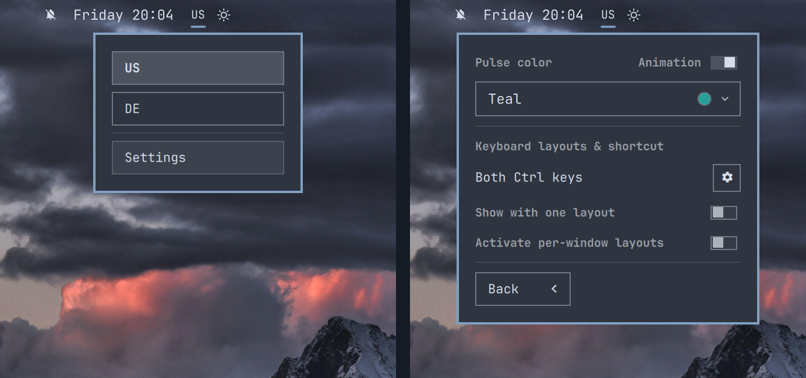

# Keyboard Layout Pulse



A compact keyboard-layout picker for the Omarchy Quattro bar. It shows the
active XKB layout, opens a native layout menu, and optionally pulses after a
layout change to improve visual confirmation of the layout change.

## Requirements

- Omarchy Quattro: >= 4.0.0
- One or more keyboard layouts configured in `~/.config/hypr/input.lua`

No additional packages or background services are required.

## Install

```bash
omarchy plugin add \
  https://github.com/ilyaZar/omarchy-keyboard-layout.git --enable
```

The plugin replaces Omarchy's built-in `omarchy.keyboard-layout` bar widget.
Removing or disabling the plugin restores the built-in widget in the same
position.

## Use

- Click the layout label to choose a configured language.
- Scroll over the label to move to the next or previous language.
- Open **Settings** from the language menu to customize the widget.
- Enable **Show with one layout** to keep the widget visible with one layout.

## Animation and color

Animation is enabled by default. After a layout change, the label pulses using
the selected color.

Turn **Animation** off for an immediate, plain layout change with no pulse,
scale effect, or accent color. The color controls become shaded and inactive;
the selected color remains saved for the next time Animation is enabled.

The color dropdown puts **Custom** first, followed by fixed presets:

- Teal: `#2aa198`
- Purple: `#a77bd8`
- Blue: `#3b82f6`
- Nord yellow: `#ebcb8b`

Custom accepts exactly six-digit hex colors such as `#2aa191`. **Apply** saves
the color and closes the menu.

## Layouts and keybindings

The plugin reads the effective layouts and `grp:*` switching option directly
from Hyprland. It translates XKB descriptions into friendly names such as **Both
Alt keys** and **Super + Space**.

Use the gear beside the displayed shortcut to open its owning line in
`~/.config/hypr/input.lua` with `nvim`.

The plugin never rewrites the Hyprland input file. Layout and keybinding changes
remain owned by Omarchy and Hyprland.

## Remove

```bash
omarchy plugin remove io.github.ilyazar.keyboard-layout --yes
```

Removal also deletes the plugin's saved appearance and visibility preferences.

## License

MIT
